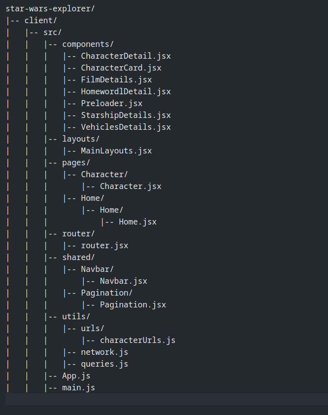
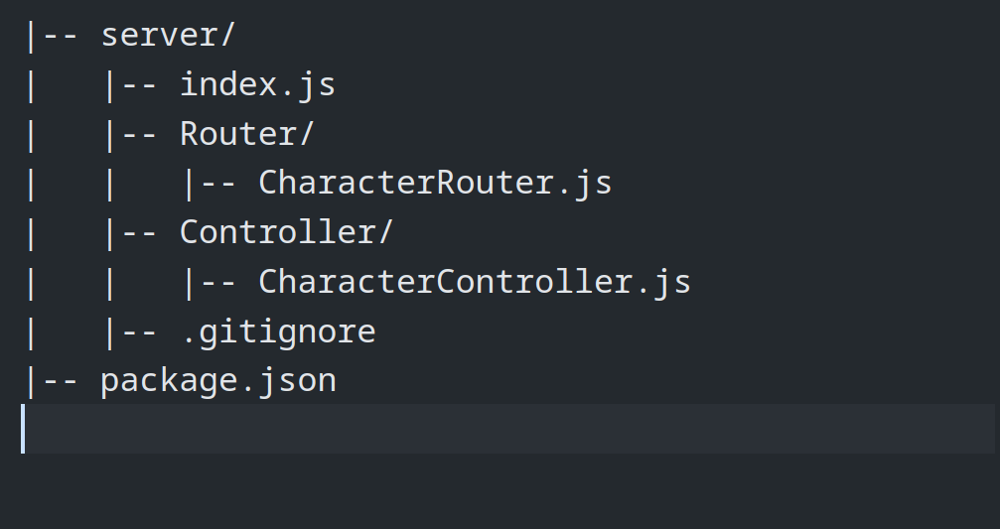

# **Project Server Installaction (This Is For Server)**

`Clone Git Repository :`

```
git clone https://github.com/codewithashim/Star-Wars-Server.git
```

### Install Dependancy

`cd/server`

```
npm install
```

### Start The Server

```
nodemon server
```

# API Live Server Link

`  https://star-wars-server.vercel.app/api/v1/`

# API List

| S. No | Base URL                      | API Endpoint                        | Method |
| ----- | ----------------------------- | ----------------------------------- | ------ |
| 01    | http://localhost:5000/api/v1/ | characters?page=${page}             | GET    |
| 02    | http://localhost:5000/api/v1/ | characters/search?q=${searchQuery}` | GET    |
| 03    | http://localhost:5000/api/v1/ | characters/:id                      | GET    |
| 04    | http://localhost:5000/api/v1/ | characters/:id/homeworld            | GET    |
| 05    | http://localhost:5000/api/v1/ | characters/:id/films                | GET    |
| 06    | http://localhost:5000/api/v1/ | characters/:id/vehicles             | GET    |
| 07    | http://localhost:5000/api/v1/ | characters/:id/starships            | GET    |

# **Installaction Gideline (This Is For Client)**

### Stape 01 :

` Clone Git Repository :`

```
git clone https://github.com/codewithashim/Star-Wars-Clients.git
```

### Stape 02 :

` Install Dependancy :`

`cd/client`

```
npm install
```

### Stape 03 :

`Start The Project :`

```
npm run dev
```

# **Project Live Link**

`https://stars-wars.vercel.app/ `

[Live Link](https://stars-wars.vercel.app/ "https://stars-wars.vercel.app/")

# Project Structure

# Clients Structure



# Server Structure


